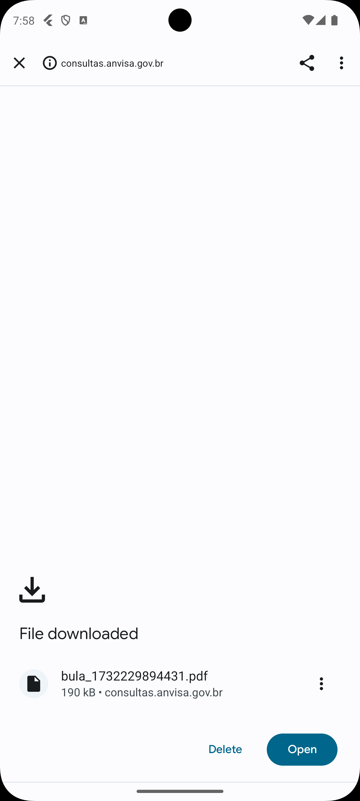

# Medici


Created to assist users in managing their medications, ensuring that medications are taken correctly and at the right time. Medici allows users to register medications according to their prescriptions, setting reminders that send notifications with the correct dose to be taken, whether in tablets or milliliters. Furthermore, the application notifies you when the quantity of a medication is running low, offers a consultation of the medication leaflet, and allows you to archive and delete medications.

## Features

- Notifications (take med, expiration and quantity alerts)
- Modal for in app alerts
- Leaflets API
- Manage drugs
- Launch Browser for Leaflet consulting
- Camera integration for drug pictures

## Technologies

- Flutter
- SQLite3
- GoLang
- Make
- Vercel

## Screenshots

<p float="left">
    
    
    
    
    
    
    
    
    
</p>

## Building by yourself

### API

The application uses a custom API for handling leaflets from Anvisa's public API.

To build it by yourself, you may need to install:

- [GoLang](https://go.dev/)
- [make](https://www.gnu.org/software/make/)

Then go to the API's directory and run:

```bash
make && ./server
```

It's all you need to run locally.

### Mobile App

The flutter application is very straightforward to build and run in your machine.

First install the flutter and its required SDKs:

- [Flutter](https://flutter.dev/)

Then go into the mobile application directory ([medici](./medici/)) and run:

```bash
flutter pub get

# then
flutter run
# or
flutter build apk
```

## Installing

You can build the whole project locally if you want, however you can get the prebuilt APK [here]() and make request to the api using the URL: `https://leaflet-dpbm-dpbms-projects.vercel.app/api/medicine/`.

For further informations about the API usage click [here](./leaflet/readme.md).

## Group Members

This app were done during our classes on programming languages paradigms at [UNIVEM - Centro Universitário Eurípides de Marília](https://www.univem.edu.br/).

- [Alexandre](https://github.com/Dpbm)
- [Gabriela](https://github.com/Gsr13)
- Hugo
